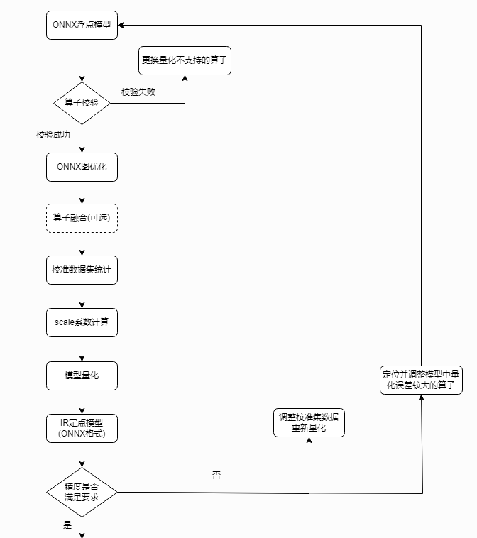

# onnx-quantization

## Overview
Quantization in ONNX Runtime refers to 8 bit linear quantization of an ONNX model.

During quantization, the floating point values are mapped to an 8 bit quantization space of the form: `val_fp32 = scale * (val_quantized - zero_point)`

`scale` is a positive real number used to map the floating point numbers to a quantization space. It is calculated as follows:

For asymmetric quantization:
```formula
 scale = (data_range_max - data_range_min) / (quantization_range_max - quantization_range_min)
```

For symmetric quantization:
```formula
 scale = max(abs(data_range_max), abs(data_range_min)) * 2 / (quantization_range_max - quantization_range_min)
```

`zero_point` represents zero in the quantization space. It is important that the floating point zero value be exactly representable in quantization space. This is because zero padding is used in many CNNs. If it is not possible to represent 0 uniquely after quantization, it will result in accuracy errors.



## References
- [onnxruntime docs](https://onnxruntime.ai/docs/)
- [onnxruntime quantization](https://onnxruntime.ai/docs/performance/model-optimizations/quantization.html)
- [ONNX Runtime Quantization Example](https://github.com/microsoft/onnxruntime-inference-examples/blob/main/quantization/image_classification/cpu/ReadMe.md), Pre-processing step

## object detection
### YOLO
- [YOLOv8](./object_detection/YOLOv8/README.md)

