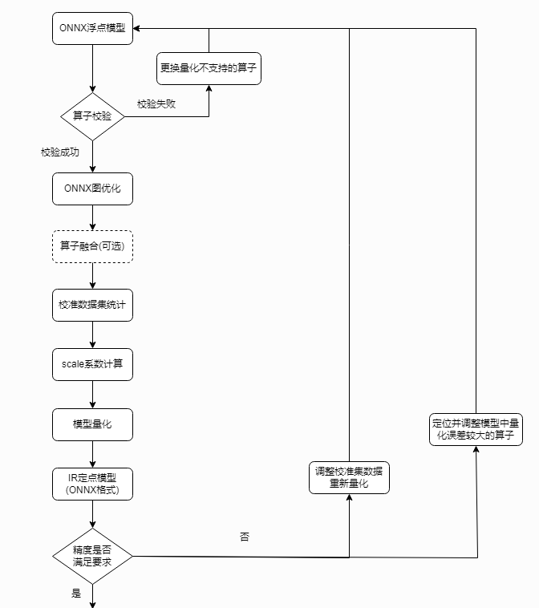
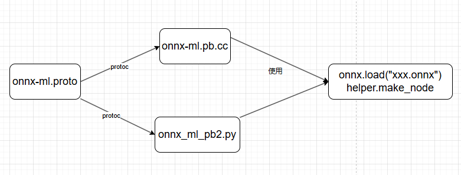
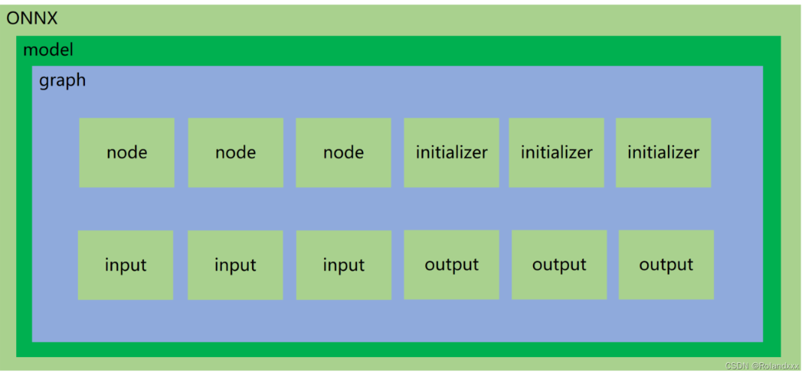

# onnx-quantization

## Overview
Quantization in ONNX Runtime refers to 8 bit linear quantization of an ONNX model.

During quantization, the floating point values are mapped to an 8 bit quantization space of the form: `val_fp32 = scale * (val_quantized - zero_point)`

`scale` is a positive real number used to map the floating point numbers to a quantization space. It is calculated as follows:

For asymmetric quantization:
```formula
 scale = (data_range_max - data_range_min) / (quantization_range_max - quantization_range_min)
```

For symmetric quantization:
```formula
 scale = max(abs(data_range_max), abs(data_range_min)) * 2 / (quantization_range_max - quantization_range_min)
```

`zero_point` represents zero in the quantization space. It is important that the floating point zero value be exactly representable in quantization space. This is because zero padding is used in many CNNs. If it is not possible to represent 0 uniquely after quantization, it will result in accuracy errors.



## how to use it
- [onnxruntime-inference-examples](https://github.com/microsoft/onnxruntime-inference-examples/tree/main/quantization)
- 

## ONNX
- [onnx tutorial](https://github.com/onnx/tutorials)
### ONNX文件介绍
- 1、.ONNX的本质，是一种[Protobuf](https://github.com/protocolbuffers/protobuf)格式文件
- 2、Protobuf则通过onnx-ml.proto编译得到onnx-ml.pb.h和onnx-ml.pb.cc或onnx_ml_pb2.py

- 3、然后用onnx—ml.pb.cc和代码来操作onnx模型文件，实现增删改
- 4、onnx—ml.proto则是描述onnx文件如何组成的，具有什么结构，他是操作onnx经常参照的东西
- [details](https://github.com/onnx/onnx/blob/main/docs/IR.md)、[concepts](https://onnx.ai/onnx/intro/concepts.html)

### ONNX结构

- model：表示整个onnx的模型，包含图结构和解析器格式、opset版本、导出程序类型model.graph：表示图结构，通常是我们netron看到的主要结构
- model.graph.node:表示图中的所有节点，数组，例如conv、bn等节点就是在这里的，通过input、output 表示节点之间的连接关系
- model.graph.initializer:权重类的数据大都储存在这里
- model.graph.input：整个模型的输入储存在这里，表明哪个节点是输入节点，shape是多少model.graph.output：整个模型的输出储存在这里，表明哪个节点是输出节点，shape是多少
- 对于anchorgrid类的常量数据，通常会储存在model.graph.node中，并指定类型为Constant,该类型节点在 netron中可视化时不会显示出来
- [onnx文件及其结构、正确导出onnx、onnx读取、onnx创建、onnx修改、onnx解析器](https://blog.csdn.net/Rolandxxx/article/details/127713806)

### ONNX文件操作
- [code](./onnx-editor/readme.md)
- 1.ONNX的主要结构：graph、graph.node、graph.initializer、graph.input、graph.output
- 2.ONNX的节点构建方式：onnx.helper,各种make函数
- 3.ONNX的proto文件：[onnx-proto2](https:/github.com/onnx/onnx/blob/main/onnx/onnx-ml.proto)
- 4.理解模型结构的储存、权重的储存、常量的储存、netron的解读对应到代码中的部分

### ONNX模型文件正确导出
1. 对于任何用到shape、size返回值的参数时，例如：`tensor.view(tensor.size(0),-1)`这类操作，避免直接使用tensor.size的返回值，而是加上**int转换**，`tensor.view(int(tensor.size(0),-1)`,**断开跟踪**
2. 对于nn.Upsample或nn.functional.interpolate函数，使用scale_factor指定倍率，而不是使用size参数指定大小
3. 对于reshape、view操作时，—1的指定请放到batch维度。其他维度可以计算出来即可。batch维度禁止指定为大于-1的明确数字
4. torch.onnx.export指定dynamic_axes参数，并且只指定batch维度，禁止其他动态
5. 使用opset_version=11,不要低于11
6. 避免使用inplace操作，例如`y[·,0:2]=y[·,0:2]*2-0.5`
7. 尽量少的出现5个维度，例如ShuffleNet Module，可以考虑合并wh避免出现5维
8. 尽量把让后处理部分在onnx模型中实现，降低后处理复杂度
9. 掌握了这些，就可以保证后面各种情况的顺利了

这些做法的必要性体现在，简化过程的复杂度，去掉gather、shape类的节点，很多时候，部分不这么改看似也是可以但是需求复杂后，依旧存在各类问题。按照说的这么修改，基本总能成。做了这些，就不需要使用onnx—simplifer了

## References
- [onnxruntime docs](https://onnxruntime.ai/docs/)、[onnx docs](https://onnx.ai/onnx/index.html)
- [onnxruntime quantization](https://onnxruntime.ai/docs/performance/model-optimizations/quantization.html)
- [ONNX Runtime Quantization Example](https://github.com/microsoft/onnxruntime-inference-examples/blob/main/quantization/image_classification/cpu/ReadMe.md), Pre-processing step

## object detection
### YOLO
- [YOLOv8](./object_detection/YOLOv8/README.md)

